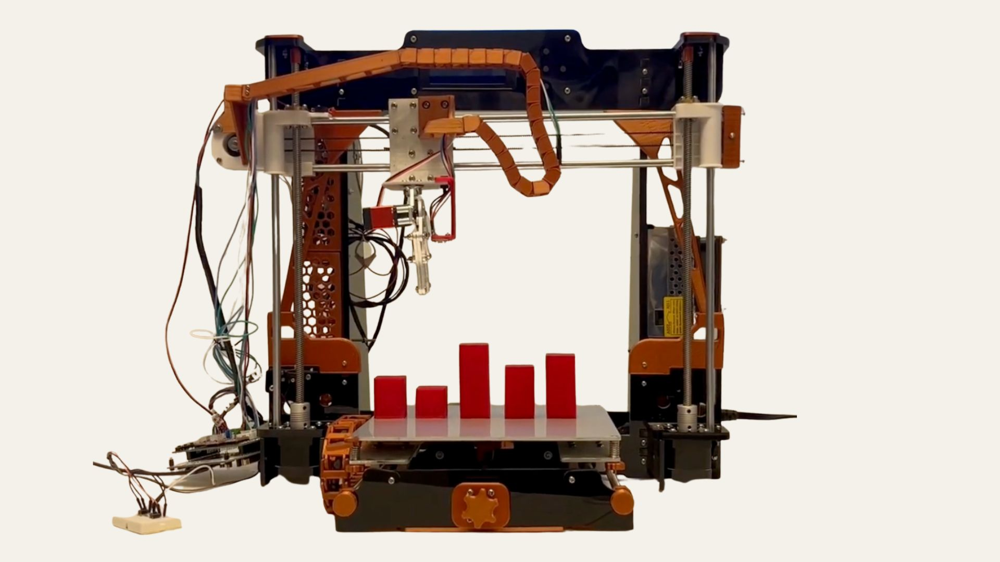
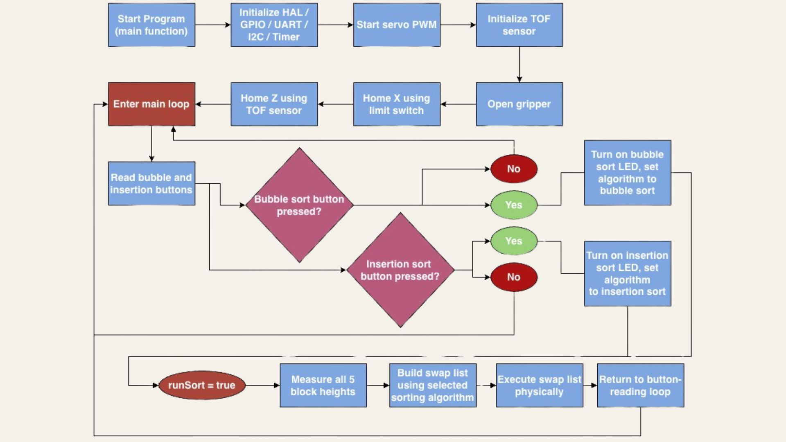
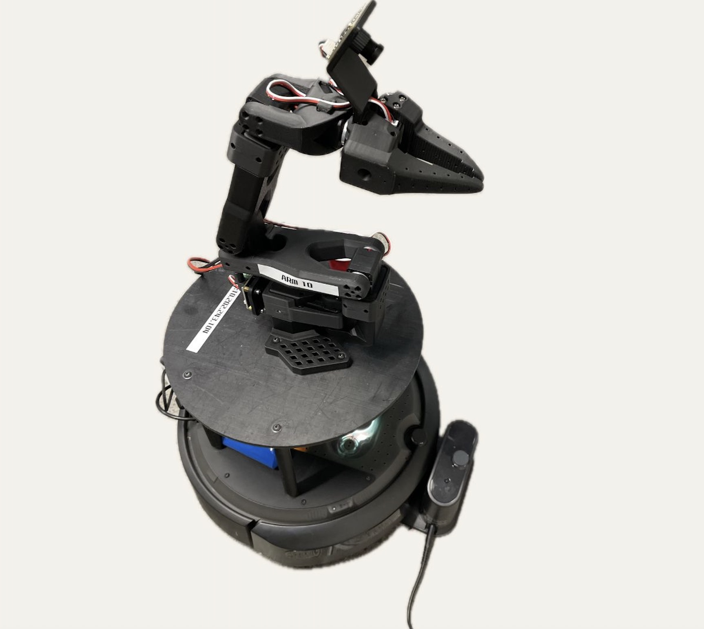
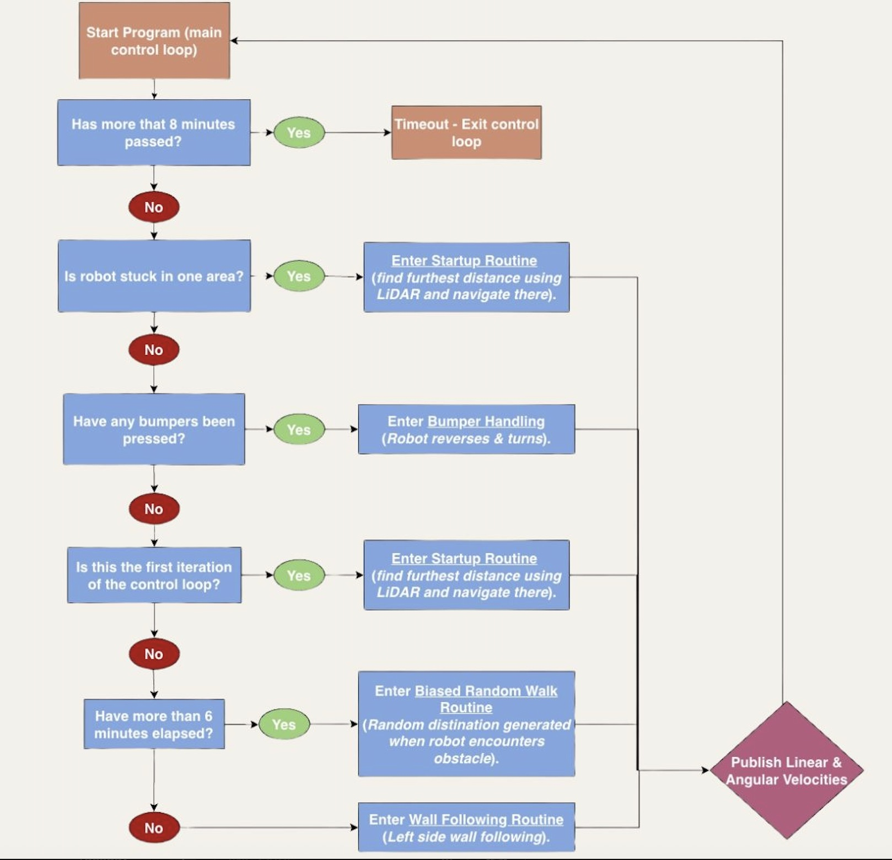
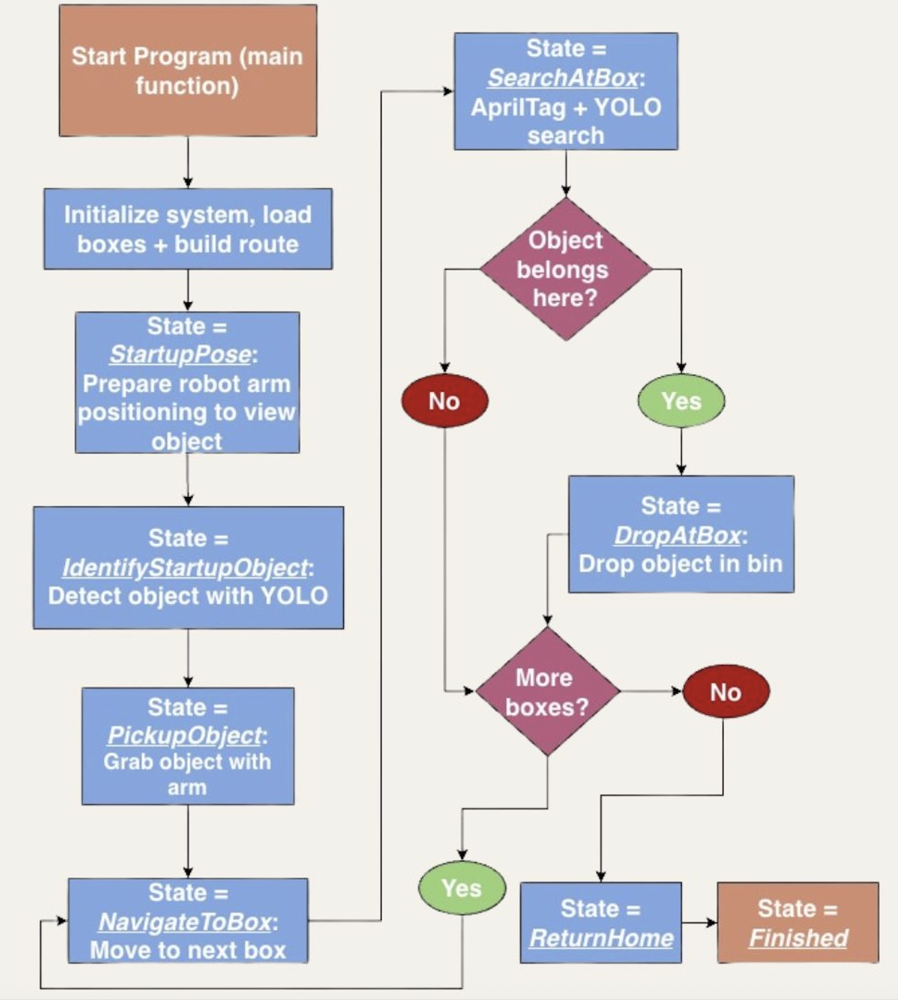

# ProjectPortfolio

## STM32 Block Sorter

Embedded C firmware for an STM32F446RETx NUCLEO board that automates physical block sorting.
The system uses a VL53L0X time-of-flight sensor to measure block heights, then drives stepper motors and a servo gripper to execute swaps.
Users select bubble sort or insertion sort with onboard buttons, and the robot performs the full sorting sequence.
Developed in STM32CubeIDE for pin/peripheral setup, code generation, build, flashing, and debugging.
The robot’s mechanical platform was built by repurposing components from an old 3D printer.
Robot successfully executes height measurements and swapping algorithm for bubble sort and insertion sort.
#### My Work: 

Main Code File: [main.c](STM32_BlockSorter/Core/Src/main.c).

## ROS2 Turtlebot Projects 

### ROS2 Autonomous Mapping Project (MIE443 Contest 1)
Autonomous ROS2 navigation node for an iRobot Create/Turtlebot-style robot, written in C++. It uses LiDAR, odometry, and bumper feedback to handle startup alignment, wall following, and obstacle recovery to map out an unknown environment in SLAM. 
The robot was able to successfully map out a 4.87 m x 4.87 m area with static obstacles in well under 8 minutes (course requirement).
#### My Work: 

Main Code File: [contest1.cpp](ROS2_Turtlebot_Projects/mie443_contest1/src/contest1.cpp).

### ROS2 Autonomous Pickup & Delivery (MIE443 Contest 2)
ROS2 mission-control software for a mobile robot and arm system, combining AprilTag detection, YOLO-based object detection, route planning, navigation, and pickup/drop state control. Uses nav2 for navigation and YOLO (with OpenCV for image handling) for detection. 
The robot was able to successfully identify an object with a wrist camera attached to its arm, pick it up, choose the optimal path to navigate to various boxes around its contest environment, identify objects using its front camera (OAK-D Camera), and pick up an object to perform a dropping motion if the object it identifies with the front camera matches the object it is carrying.
#### My Work: 

Main Code File (in C++): [contest2.cpp](ROS2_Turtlebot_Projects/MIE443_contest2/mie443_contest2/src/contest2.cpp) 
Image Detection File (in python): [yolo_detector.py](ROS2_Turtlebot_Projects/MIE443_contest2/mie443_contest2/src/yolo_detector.py); the other files in the project were provided as part of the course framework.